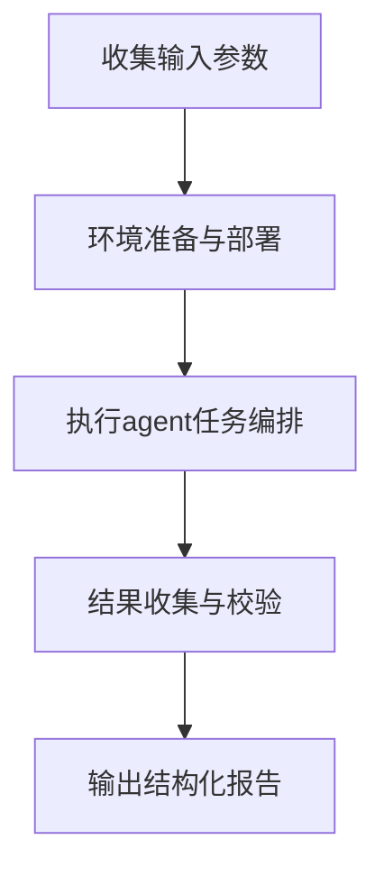

---
> 本内容由 AI 生成，仅供学习参考（《人工智能生成合成内容标识办法》显式标识）。
<!-- ai-generated-notice -->
slug: agents
name: 多智能体协作框架
displayName: 任务拆解 多角色协同 结果归并
description: 编排多个AI Agent分工协作，完成复杂任务并输出结构化结果
version: 1.0.17
license: MIT
source_project: original
source_url: https://github.com/bluebigman/skill-factory-originals/tree/main/agents
copyright_holder: 原创作者（自持版权）
ai_generated: true
ai_tools: ["DeepSeek"]
disclaimer: 本Skill由AI辅助生成，提供使用指导和最佳实践。使用前请阅读相关文档。
author: 协同流工作室
agent_created: true
trigger_words:
  - "多智能体"
  - "多代理协作"
  - "agent编排"
  - "任务分工"
---

# 多智能体协作框架 · 技能文档

```yaml

```

> 本内容由 AI 生成，仅供学习参考 <!-- ai-generated-notice -->

---

## 一、适用场景与前置条件

本技能适用于需要将一项复杂任务拆解为多个子任务，并由不同角色的 AI Agent 并行或串行处理的场景。典型用途包括：研究报告撰写、代码模块开发、内容多维度审核、数据分析流水线等。

**使用前请确认以下条件已满足：**

| 条件项 | 要求 |
|--------|------|
| 运行环境 | 已安装 Node.js 18+ 或 Python 3.9+（取决于 CLI 实现） |
| 项目仓库 | 目标仓库已可访问（本地路径或远程 Git URL） |
| 依赖管理 | 项目包含 `package.json` 或 `requirements.txt` 等依赖声明文件 |
| 网络权限 | 若使用远程仓库，需具备克隆与拉取权限 |
| 基础命令 | `git`、`npm`/`pip`、`./main` 可执行文件已就绪 |

---

## 二、执行流程总览

整个运行过程分为四个阶段，按序推进：



---

## 三、详细执行步骤

### 步骤 1：收集用户输入并确认格式

用户需提供以下信息（至少包含任务描述）：

- **任务描述**：自然语言描述需要完成的目标
- **Agent 角色配置**（可选）：指定参与协作的 Agent 类型与数量
- **参数覆盖**（可选）：覆盖默认 CLI 参数的键值对

**输入格式校验规则：**

| 输入类型 | 合法格式 | 非法示例 |
|----------|----------|----------|
| 任务描述 | 非空字符串，长度 ≥ 10 字符 | 空、纯标点 |
| 角色配置 | JSON 数组，元素为合法角色名 | 非 JSON、未知角色 |
| 参数覆盖 | `key=value` 对，用空格分隔 | 缺少 `=`、值为空 |

> 若输入不满足上述规则，直接进入“失败处理”章节，返回错误说明与正确格式示例。

### 步骤 2：环境准备与项目部署

```bash
# 2.1 获取项目源码
if [ -d "./workspace" ]; then
    cd ./workspace
    git pull origin main
else
    git clone <repository_url> ./workspace
    cd ./workspace
fi

# 2.2 安装依赖
if [ -f "package.json" ]; then
    npm install
elif [ -f "requirements.txt" ]; then
    pip install -r requirements.txt
else
    echo "WARNING: 未找到依赖声明文件，跳过安装"
fi

# 2.3 确认 CLI 可执行
chmod +x ./main
./main --version  # 验证安装成功
```

**环境就绪标准：**
- 退出码为 0
- `./main --version` 能输出版本号

### 步骤 3：执行 Agent 任务编排

#### 3.1 基础命令格式

```bash
./main --task "<任务描述>" [--agents '<角色JSON>'] [--params "key=value key2=value2"]
```

#### 3.2 常用参数说明

| 参数 | 必填 | 默认值 | 说明 |
|------|------|--------|------|
| `--task` | 是 | 无 | 任务描述文本 |
| `--agents` | 否 | 默认角色组 | 角色配置 JSON 数组 |
| `--params` | 否 | 空 | 自定义参数对 |
| `--output` | 否 | `./output` | 结果输出目录 |
| `--timeout` | 否 | 300 | 单 Agent 超时秒数 |
| `--retry` | 否 | 2 | 失败重试次数 |

#### 3.3 典型调用示例

```bash
# 示例1：默认配置执行
./main --task "分析用户流失原因并提出3条改进建议"

# 示例2：指定角色分工
./main --task "编写一个登录模块的单元测试" \
    --agents '[{"role":"架构师","count":1},{"role":"测试工程师","count":2}]'

# 示例3：覆盖超时与输出路径
./main --task "生成季度销售报告" \
    --params "year=2025 quarter=Q1" \
    --output "./reports" --timeout 600
```

#### 3.4 帮助信息查询

任何时候可运行以下命令获取完整用法：

```bash
./main --help
```

该命令会输出所有可用参数、示例与退出码说明。

### 步骤 4：结果收集与完整性校验

#### 4.1 捕获输出

执行完成后，程序会自动捕获并保存：

- **标准输出（stdout）** → 保存至 `{output_dir}/stdout.log`
- **错误输出（stderr）** → 保存至 `{output_dir}/stderr.log`
- **文件型产出** → 保存至 `{output_dir}/artifacts/` 目录

#### 4.2 完整性校验规则

| 检查项 | 通过标准 |
|--------|----------|
| 退出码 | 等于 0 |
| stdout 非空 | 日志文件大小 > 0 字节 |
| 关键产出存在 | `artifacts/` 下存在预期文件（若任务声明了产出） |
| 无致命错误 | stderr 中不包含 `FATAL` 或 `ERROR` 级别日志 |

#### 4.3 输出结构化整理

最终结果按以下 JSON 结构返回给调用方：

```json
{
  "status": "success",
  "exit_code": 0,
  "summary": "任务执行摘要，由主 Agent 生成",
  "artifacts": [
    {"name": "report.md", "path": "./output/artifacts/report.md", "size": 2048}
  ],
  "stdout_log": "./output/stdout.log",
  "stderr_log": "./output/stderr.log",
  "agents_involved": ["架构师", "测试工程师"]
}
```

---

## 四、失败处理机制

### 4.1 常见失败类型与应对

| 失败场景 | 检测方式 | 处理策略 |
|----------|----------|----------|
| 输入格式错误 | 前置校验不通过 | 返回错误码 1，附带正确格式示例 |
| 环境部署失败 | 依赖安装或克隆报错 | 返回错误码 2，提示检查网络与权限 |
| Agent 执行超时 | 单个 Agent 运行超过 `--timeout` | 自动重试（次数由 `--retry` 控制），仍失败则终止 |
| 输出校验不通过 | 退出码非 0 或产出缺失 | 返回错误码 3，附上 stderr 日志路径 |

### 4.2 错误信息模板

```
[错误码 {code}] {错误类型}
原因：{具体原因描述}
解决方法：{可操作建议}
正确示例：{符合格式的输入示例}
日志位置：{stdout/stderr 文件路径}
```

### 4.3 强制终止与清理

- 若任务连续失败超过 `--retry` 上限，框架将终止后续 Agent 调度
- 所有已生成的中间文件保留在输出目录，便于排查
- 可手动删除工作目录：`rm -rf ./workspace ./output`

---

## 五、最佳实践建议

1. **任务描述越具体，结果质量越高**：建议包含背景、约束、交付物格式
2. **合理规划角色分工**：避免角色过多导致协调开销过大，常规任务 2-4 个 Agent 即可
3. **善用参数覆盖**：不同场景下的差异化配置可通过 `--params` 灵活传入
4. **定期清理输出目录**：避免历史产物干扰后续任务
5. **先小规模验证**：在完整任务前，先用小规模测试确认环境与角色配置无误

---

## 六、版本与更新说明

当前版本：1.0.0

本技能文档随框架迭代更新。若框架 CLI 参数或行为发生变化，请以 `./main --help` 输出为准，并同步更新本技能的使用方式。

---

*本文档由 AI 辅助生成，用于指导多智能体协作框架的使用。实际执行时请以命令输出为准。*

## 许可证（License）

```text
MIT License

Copyright (c) 2026 SkillForge Lab

Permission is hereby granted, free of charge, to any person obtaining a copy
of this software and associated documentation files (the "Software"), to deal
in the Software without restriction, including without limitation the rights
to use, copy, modify, merge, publish, distribute, sublicense, and/or sell
copies of the Software, and to permit persons to whom the Software is
furnished to do so, subject to the following conditions:

The above copyright notice and this permission notice shall be included in all
copies or substantial portions of the Software.
```
<!-- professional-license-embedded -->

## 前置条件

- Python 3.9+（脚本依赖标准库，无需联网即可运行自检）
- 已获取待处理的输入文件，并对其拥有合法使用权
- 建议先在样本数据上试运行，确认输出符合预期后再批量处理

## 执行步骤

1. **准备输入**：将待处理文件放入同一目录，确认命名规范一致。
2. **试运行**：先用单个样本执行，核对输出字段与格式。
3. **批量执行**：确认无误后对全量数据执行，并保留原始文件备份。
4. **校验结果**：抽查输出条目，核对关键字段与源数据一致。

## 异常处理

| 异常情况 | 表现 | 处理方式 |
|---|---|---|
| 输入文件不存在 | 提示路径错误并退出 | 核对路径，使用绝对路径重试 |
| 文件格式不符 | 该条跳过并计入失败明细 | 转换为受支持格式后重跑该条 |
| 权限不足 | 写入失败 | 更换输出目录或提升目录写权限 |
| 单条数据异常 | 跳过该条，继续处理其余 | 处理结束后查看失败明细定向重跑 |

失败处理原则：**单条失败不中断整批**，全部异常汇总到失败明细，支持只重跑失败项。

## 能力边界

**能做**：标准格式的批量处理、字段提取与结构化输出、失败明细追踪。

**不能做**：不保证对加密、损坏或非标准格式文件的处理结果；不替代人工对关键数据的最终核对。

**不适用**：涉及重大决策的数据请以官方原始凭证为准，本工具输出仅供效率参考。

## 稳定性保障

- **超时控制**：单条处理设置上限，超时自动跳过并记入失败明细，避免整批卡死。
- **重试策略**：可恢复类错误（临时占用、瞬时 IO 失败）自动重试 3 次，间隔递增。
- **降级方案**：高级解析失败时自动回退到基础解析模式，保证有可用输出而非直接报错。
- **幂等性**：重复执行同一批输入结果一致，不会产生重复追加。

## FAQ 与反模式

**Q：可以直接对原始文件覆盖写入吗？**
A：不建议。默认输出到独立文件，保留原始数据是可回溯的前提。

**Q：处理到一半失败了怎么办？**
A：已完成部分的输出有效，查看失败明细后只重跑失败项即可，无需整批重来。

**反模式 ①**：不做试运行直接批量处理全量数据 —— 参数配错会一次性污染全部输出。

**反模式 ②**：忽略失败明细只看成功数 —— 静默跳过的条目会造成数据缺口。

**反模式 ③**：把工具输出直接作为最终结论 —— 关键字段务必人工抽检。

## 安全声明

- 全流程本地执行，不上传任何用户数据到第三方服务。
- 不读取与任务无关的目录，不写入系统目录。
- 处理含个人信息的数据时，请自行遵守《个人信息保护法》等相关法规。
- 本 Skill 代码由 AI 辅助生成并经自检验证，以 MIT 协议开源，使用者自负使用后果。
