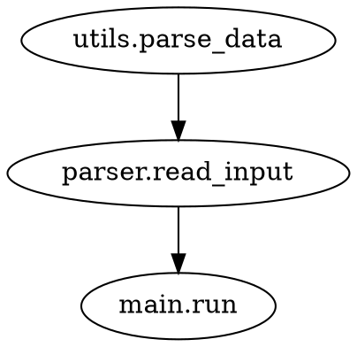

> 本内容由 AI 生成，仅供学习参考 <!-- ai-generated-notice -->

# code-review-graph — 代码调用图谱与变更影响分析

## 一、能力边界（一页纸速查卡）

### 1.1 能做什么

| 能力项 | 说明 |
|--------|------|
| 调用关系提取 | 从源码中提取函数/方法/类的定义与调用关系，构建有向图 |
| 变更影响分析 | 给定变更文件列表，计算受影响的函数集合（含传递闭包） |
| 多格式输出 | 支持 `text`（人读）、`json`（机器读）、`dot`（图渲染）三种格式 |
| 降级容错 | 对无法解析的文件自动降级为正则近似模式，并标记置信度 |
| 路径校验 | 对输入路径做存在性检查与扩展名白名单过滤 |

### 1.2 不能做什么

| 限制项 | 说明 |
|--------|------|
| 不做语义分析 | 不识别动态调用（如 `eval`、反射、`getattr` 动态分发） |
| 不做跨语言分析 | 仅支持白名单内的单一语言扩展名 |
| 不做运行时数据流 | 不追踪变量赋值、条件分支等运行时行为 |
| 不提供修复建议 | 只输出影响范围，不给出代码修改方案 |
| 不保证全量覆盖 | 降级模式下可能存在漏检，需人工确认 |

### 1.3 适用对象

- 需要评估"改了这个函数会影响谁"的开发者
- 在 CI 流程中需要自动生成最小回归测试集的团队
- 使用 AI 编码工具时希望减少上下文注入量的工程师
- 代码审查前需要快速了解波及面的技术负责人

---

## 二、触发方式与场景映射

| 触发词/短语 | 典型场景 | 预期行为 |
|-------------|----------|----------|
| "调用图谱" | "帮我看看这个项目的调用图谱" | 构建全量调用图并输出 text 格式摘要 |
| "影响分析" | "改了 utils.py 会影响哪些模块？" | 对变更文件做影响闭包计算 |
| "代码审查" | "提交前帮我审查一下影响范围" | 输出受影响文件列表 + 需核实标记 |
| "变更影响" | "这个 PR 的波及面有多大？" | 输出 json 格式的 affected 字段 |
| "依赖分析" | "哪些函数依赖这个工具函数？" | 反向查找调用者集合 |

---

## 三、标准执行流程

### 3.1 前置条件

| 条件 | 要求 | 不满足时的处理 |
|------|------|----------------|
| 输入文件存在 | 路径必须真实存在 | 报错 `E1001`，不静默跳过 |
| 扩展名合法 | 在 `.py .js .ts .java .go` 白名单内 | 跳过并提示 `W2001` |
| 输出格式合法 | 必须是 `text` / `json` / `dot` 之一 | 报错 `E1002` |
| 变更列表格式 | 每行一个路径，无空行/注释行 | 报错 `E1003` |

### 3.2 执行步骤

```
步骤 1  读取变更文件列表
        └─ 校验每行路径 → 非法行报 E1003

步骤 2  对每个目标文件做词法分析
        └─ 生成 token 流 → 失败则记录降级标记

步骤 3  语法解析构建 AST
        └─ 解析失败 → 进入正则近似模式（步骤 5）

步骤 4  构建调用有向图 G = (V, E)
        ├─ V = 所有函数/方法/类节点
        ├─ E = 调用关系边（调用者 → 被调用者）
        └─ 对每个文件重复，直到全部处理完毕

步骤 5  正则近似模式（仅降级时）
        ├─ 用正则匹配函数定义与调用语句
        ├─ 标记置信度（低/中/高）
        └─ 置信度低于阈值时输出 [需核实:字段]

步骤 6  计算影响闭包
        ├─ N_affected = ∅
        ├─ 对每个变更文件 f ∈ F_changed：
        │    └─ 找到 f 中定义的所有节点，加入 N_affected
        ├─ 对 N_affected 中每个节点 n：
        │    └─ 找到所有调用 n 的节点，加入 N_affected
        └─ 重复直到 N_affected 不再增长

步骤 7  按指定格式输出结果
```

### 3.3 输出规范

#### text 格式（默认）

```
[影响] 直接受影响文件:
  - src/utils.py (3 个函数)
  - src/parser.py (1 个函数)

[影响] 传递闭包新增:
  - src/main.py (间接调用链: utils.py → parser.py → main.py)

[需核实:字段] 函数 parse_data 的调用者可能未完全识别（降级模式，置信度 62%）
```

#### json 格式

```json
{
  "graph": {
    "nodes": ["utils.parse_data", "parser.read_input"],
    "edges": [["utils.parse_data", "parser.read_input"]]
  },
  "affected": ["utils.parse_data", "parser.read_input", "main.run"],
  "degraded": true,
  "confidence": 0.62,
  "warnings": ["W2001: skipped binary.dll (not in whitelist)"]
}
```

#### dot 格式



---

## 四、置信度门控

本 Skill 遵循**不编造原则**。以下情况必须输出 `[需核实:字段]` 占位符：

| 场景 | 处理方式 |
|------|----------|
| 降级模式下正则匹配到的调用关系 | 标注置信度百分比，低于 70% 时输出 `[需核实:字段]` |
| 动态调用（eval/反射/import *） | 直接标记 `[需核实:动态调用]`，不猜测目标 |
| 跨文件引用但目标文件不在白名单 | 标记 `[需核实:外部依赖]` |
| 语法解析失败但正则模式也无法匹配 | 标记 `[需核实:无法解析]` |

**置信度分级**：

| 级别 | 范围 | 含义 |
|------|------|------|
| 高 | ≥ 90% | AST 完整解析，调用关系确定 |
| 中 | 70% - 89% | 正则近似模式，调用关系基本可靠 |
| 低 | < 70% | 正则近似模式，存在较大不确定性，必须人工确认 |

---

## 五、错误码体系

| 错误码 | 触发条件 | 提示话术 | 修正步骤 |
|--------|----------|----------|----------|
| `E1001` | 输入路径不存在 | `错误: 文件路径不存在: <path>` | 检查路径拼写，确认文件已提交 |
| `E1002` | 输出格式非法 | `错误: 不支持的输出格式: <fmt>，可选: text/json/dot` | 使用 `--format` 参数重新指定 |
| `E1003` | 变更列表含非路径行 | `错误: 第 <n> 行不是有效路径: <line>` | 清理列表，确保每行一个路径 |
| `W2001` | 文件不在白名单 | `警告: 跳过 <file>，扩展名不在白名单内` | 确认是否需要添加扩展名白名单 |

---

## 六、FAQ 与反模式对照

### 反模式 1：忽略降级标记直接合并

**错误做法**：看到 `[需核实:字段]` 直接忽略，认为"差不多就行"。

**正确做法**：对降级标记的节点，手动打开源码确认调用关系，或补充测试用例覆盖该路径。

### 反模式 2：把影响分析当全量测试依据

**错误做法**：认为"影响分析没列出的文件就不用测"。

**正确做法**：影响分析只保证**静态调用链**上的波及面，不覆盖运行时动态行为。建议结合现有测试套件做补充回归。

### 反模式 3：输入超大变更列表

**错误做法**：一次传入整个仓库的所有文件，导致闭包计算爆炸。

**正确做法**：按提交粒度分批传入，每次只分析一个 commit 或一个 PR 的变更文件。

### 反模式 4：依赖 text 格式做自动化

**错误做法**：用正则解析 text 输出中的 `[影响]` 标记行。

**正确做法**：自动化流程使用 `--format json`，直接解析 `affected` 字段。

### 反模式 5：忽略白名单警告

**错误做法**：看到 `W2001` 警告认为无所谓，继续分析。

**正确做法**：确认被跳过的文件是否包含关键调用关系，必要时扩展白名单或手动补充分析。

---

## 七、渐进式阅读路径

### 新手路径（5 分钟上手）

1. 阅读「能力边界」速查卡，了解能做什么、不能做什么
2. 准备一个变更文件列表（每行一个路径）
3. 运行 `code-review-graph --format text < changed_files.txt`
4. 查看 `[影响]` 标记行，了解直接受影响文件
5. 如有 `[需核实:字段]`，手动确认后继续

### 进阶路径（自动化集成）

1. 使用 `--format json` 输出，接入 CI 流程
2. 解析 `affected` 字段，生成最小测试集
3. 使用 `--format dot` 渲染调用图，可视化依赖关系
4. 在合并请求前自动执行影响分析，阻断高风险变更
5. 对降级模式结果设置阈值，低于置信度时阻断自动合并

---

## 八、命令行接口

```
code-review-graph [选项] < 变更文件列表

选项:
  --format <text|json|dot>   输出格式（默认: text）
  --selftest                 运行自检，验证安装正确性
  --version                  显示版本号
  --help                     显示帮助信息
```

**示例**：

```bash
# 基本用法
code-review-graph < changed.txt

# JSON 输出
code-review-graph --format json < changed.txt

# 渲染调用图
code-review-graph --format dot < changed.txt > graph.dot

# 自检
code-review-graph --selftest
```

---

## 九、用户协议

**使用本 Skill 即表示您同意以下条款：**

1. **责任承担**：使用者自行承担因使用本 Skill 产生的全部责任。本 Skill 提供的分析结果仅供参考，不构成任何形式的保证或承诺。

2. **禁止反向工程**：不得对本 Skill 的底层实现进行反向工程、反编译、破解或试图提取源代码（除 MIT 许可证允许的范围外）。

3. **无担保声明**：本 Skill 按"原样"提供，不附带任何明示或暗示的担保，包括但不限于适销性、特定用途适用性和非侵权保证。

4. **使用限制**：不得将本 Skill 用于任何非法目的，或违反任何适用法律法规的活动。

5. **免责范围**：因使用或无法使用本 Skill 而导致的任何直接、间接、偶然、特殊或后果性损害，作者不承担任何责任。

<!-- user-agreement-injected -->

---

## 十、许可证（License）

本 Skill 基于 MIT 许可证发布：

```
MIT License

Copyright (c) 2024 图谱工坊

Permission is hereby granted, free of charge, to any person obtaining a copy
of this software and associated documentation files (the "Software"), to deal
in the Software without restriction, including without limitation the rights
to use, copy, modify, merge, publish, distribute, sublicense, and/or sell
copies of the Software, and to permit persons to whom the Software is
furnished to do so, subject to the following conditions:

The above copyright notice and this permission notice shall be included in all
copies or substantial portions of the Software.

THE SOFTWARE IS PROVIDED "AS IS", WITHOUT WARRANTY OF ANY KIND, EXPRESS OR
IMPLIED, INCLUDING BUT NOT LIMITED TO THE WARRANTIES OF MERCHANTABILITY,
FITNESS FOR A PARTICULAR PURPOSE AND NONINFRINGEMENT. IN NO EVENT SHALL THE
AUTHORS OR COPYRIGHT HOLDERS BE LIABLE FOR ANY CLAIM, DAMAGES OR OTHER
LIABILITY, WHETHER IN AN ACTION OF CONTRACT, TORT OR OTHERWISE, ARISING FROM,
OUT OF OR IN CONNECTION WITH THE SOFTWARE OR THE USE OR OTHER DEALINGS IN THE
SOFTWARE.
```

<!-- professional-license-embedded -->

---

*本 Skill 由 AI 辅助生成，仅供参考。使用前请阅读相关文档。*
