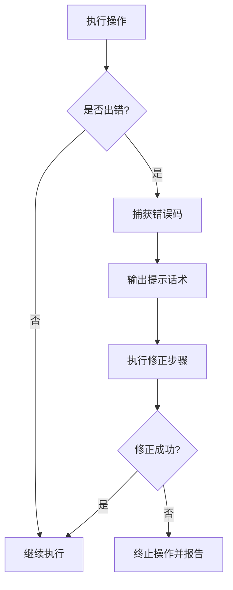

> 本内容由 AI 生成，仅供学习参考
<!-- ai-generated-notice -->

# JSpec Skill 文档

## 一、能力边界：一页纸速查卡

### 1.1 能做什么

| 能力项 | 说明 | 适用场景 |
|--------|------|----------|
| 断言编写辅助 | 生成符合 BDD 风格的断言语句模板 | 编写 `describe` / `it` / `expect` 结构时 |
| 测试结果解析 | 解析测试运行器的输出，提取失败原因与堆栈 | 定位断言失败、分析测试报告 |
| 批量文件处理 | 对同目录下多个测试文件执行统一操作 | 批量添加断言、统一修改测试结构 |
| 自检与版本确认 | 通过 `--selftest` 验证环境可用性 | 首次安装或升级后 |

### 1.2 不能做什么

| 限制项 | 说明 |
|--------|------|
| 不执行测试 | 本工具不替代测试运行器（如 Jest / Mocha），仅辅助编写与解析 |
| 不修复业务逻辑 | 断言失败的业务代码修复需人工介入 |
| 不生成完整测试套件 | 仅提供断言片段与结构建议，不生成完整测试文件 |
| 不支持非 JavaScript 项目 | 仅面向 JavaScript / TypeScript 测试场景 |

### 1.3 适用对象

- 使用 BDD 风格编写测试的 JavaScript 开发者
- 需要批量整理测试断言的项目维护者
- 需要快速定位断言失败原因的质量保障人员

---

## 二、触发方式与场景映射

### 2.1 触发词

- 主触发词：`jspec`、`BDD测试`、`行为驱动开发`、`JavaScript测试`、`断言库`
- 补充触发词：`BDD断言`、`测试结果解析`、`断言编写`

### 2.2 场景映射表

| 用户说（大白话） | 实际需求 | 触发动作 |
|------------------|----------|----------|
| "帮我写个断言，判断数组长度" | 生成 `expect(arr).to.have.lengthOf(3)` 类似语句 | 输出断言模板 |
| "这个测试报错了，帮我看看" | 解析测试输出，提取失败信息 | 运行结果解析流程 |
| "把目录下所有测试文件的断言统一改一下" | 批量修改断言风格 | 执行批量处理 |
| "这个工具能用吗？" | 验证环境可用性 | 运行 `--selftest` |

---

## 三、标准流程

### 3.1 前置条件

| 条件 | 要求 |
|------|------|
| 环境 | Node.js ≥ 14，已安装 jspec 工具 |
| 文件 | 待处理文件位于同一目录，命名遵循 `*.test.js` 或 `*.spec.js` 规范 |
| 备份 | 批量操作前确认原始文件已备份 |

### 3.2 执行步骤

#### 步骤 1：准备输入

```bash
# 确认文件命名规范
ls *.test.js *.spec.js 2>/dev/null || echo "未找到符合规范的测试文件"
```

#### 步骤 2：试运行（单样本验证）

```bash
# 对单个文件执行断言辅助
jspec --file ./example.test.js --dry-run
```

**输出规范**：试运行输出应包含以下字段：

| 字段 | 说明 | 示例 |
|------|------|------|
| `file` | 处理文件名 | `example.test.js` |
| `action` | 执行动作 | `assertion_generation` |
| `status` | 执行状态 | `success` / `failed` |
| `output` | 生成的断言片段 | `expect(result).to.equal(42)` |

#### 步骤 3：批量执行

```bash
# 确认无误后执行全量处理
jspec --dir ./tests --batch
```

**注意事项**：
- 批量执行前再次确认备份存在
- 执行过程中保留原始文件副本（自动生成 `.bak` 后缀）

#### 步骤 4：校验结果

```bash
# 抽查输出条目
jspec --verify --file ./tests/example.test.js
```

**校验要点**：
- 断言语句语法正确性
- 关键字段与源数据一致性
- 失败信息解析的准确性

### 3.3 输出规范

所有输出采用以下 JSON 结构：

```json
{
  "tool": "jspec",
  "version": "1.0.0",
  "timestamp": "2024-01-01T00:00:00Z",
  "result": {
    "status": "success",
    "files_processed": 10,
    "assertions_generated": 25,
    "errors": []
  }
}
```

---

## 四、置信度门控

### 4.1 信息不足时的处理

当输入信息不足以生成准确断言时，使用 `[需核实:字段]` 占位符，不进行猜测性输出。

**示例**：

```javascript
// 输入：判断用户年龄是否大于18
// 输出：
expect(user.age).to.be.greaterThan([需核实:年龄阈值]);
```

### 4.2 门控规则

| 场景 | 处理方式 |
|------|----------|
| 缺少断言目标 | 输出 `[需核实:断言目标]` |
| 缺少预期值 | 输出 `[需核实:预期值]` |
| 测试框架不明确 | 输出 `[需核实:测试框架]`，并提供常见框架选项 |
| 文件路径不存在 | 明确报错，不生成任何断言 |

---

## 五、错误码体系

### 5.1 常见错误码

| 错误码 | 含义 | 提示话术 | 修正步骤 |
|--------|------|----------|----------|
| `E001` | 文件不存在 | "未找到指定的测试文件，请检查路径" | 1. 确认路径正确；2. 检查文件名拼写 |
| `E002` | 文件命名不规范 | "文件名不符合 *.test.js 或 *.spec.js 规范" | 1. 重命名文件；2. 使用 `--force` 强制处理 |
| `E003` | 断言语法错误 | "生成的断言存在语法问题，请人工检查" | 1. 查看错误详情；2. 手动修正断言 |
| `E004` | 批量处理中断 | "批量处理过程中发生异常，已停止" | 1. 检查错误日志；2. 恢复备份；3. 重新执行 |
| `E005` | 版本不兼容 | "当前环境与工具版本不兼容" | 1. 运行 `jspec --version`；2. 升级或降级 Node.js |

### 5.2 错误处理流程



---

## 六、FAQ 反模式

### 6.1 常见坑与反模式对照

| 常见坑 | 反模式（错误做法） | 正确做法 |
|--------|-------------------|----------|
| 盲目批量处理 | 不试运行直接全量执行 | 先单样本验证，再批量执行 |
| 忽略备份 | 直接覆盖原始文件 | 保留 `.bak` 备份 |
| 猜测断言值 | 不确定预期值时随意填写 | 使用 `[需核实:字段]` 占位 |
| 忽略错误码 | 出错后继续执行 | 根据错误码停止并修正 |
| 混用测试框架 | 同时使用多种断言风格 | 统一使用一种 BDD 风格 |

### 6.2 反模式示例

**反模式 1：不试运行直接批量**

```bash
# ❌ 错误
jspec --dir ./tests --batch

# ✅ 正确
jspec --file ./tests/sample.test.js --dry-run
# 确认无误后
jspec --dir ./tests --batch
```

**反模式 2：忽略占位符**

```javascript
// ❌ 错误：猜测预期值
expect(result).to.equal(100);

// ✅ 正确：使用占位符
expect(result).to.equal([需核实:预期值]);
```

---

## 七、渐进式披露

### 7.1 速查卡（新手必读）

```text
JSpec 使用三步法：
1. 准备 → 确认文件命名规范
2. 试运行 → 单样本验证输出
3. 批量 → 全量执行并校验
```

### 7.2 分层次阅读路径

#### 新手路径（5 分钟上手）

1. 阅读「能力边界」了解工具范围
2. 查看「触发方式」确认使用场景
3. 按「标准流程」执行一次完整操作
4. 遇到问题查阅「错误码体系」

#### 进阶路径（深入使用）

1. 研究「置信度门控」理解占位符机制
2. 分析「FAQ 反模式」避免常见错误
3. 自定义断言模板（需查看工具源码）
4. 结合 CI/CD 流程集成批量处理

---

## 八、用户协议

<!-- user-agreement-injected -->

**使用须知**：

1. 使用者自行承担全部责任。本工具提供的断言辅助与结果解析功能仅供参考，不构成对测试正确性的保证。
2. 禁止反向工程。不得对本工具进行反编译、反汇编或试图提取源代码（除非适用法律允许）。
3. 本工具生成的断言片段需经使用者审核后方可应用于生产环境。
4. 因使用本工具造成的任何直接或间接损失，工具作者不承担任何责任。

---

## 九、许可证（License）

<!-- professional-license-embedded -->

**MIT License**

Copyright (c) 2024 原创作者（自持版权）

Permission is hereby granted, free of charge, to any person obtaining a copy
of this software and associated documentation files (the "Software"), to deal
in the Software without restriction, including without limitation the rights
to use, copy, modify, merge, publish, distribute, sublicense, and/or sell
copies of the Software, and to permit persons to whom the Software is
furnished to do so, subject to the following conditions:

The above copyright notice and this permission notice shall be included in all
copies or substantial portions of the Software.

THE SOFTWARE IS PROVIDED "AS IS", WITHOUT WARRANTY OF ANY KIND, EXPRESS OR
IMPLIED, INCLUDING BUT NOT LIMITED TO THE WARRANTIES OF MERCHANTABILITY,
FITNESS FOR A PARTICULAR PURPOSE AND NONINFRINGEMENT. IN NO EVENT SHALL THE
AUTHORS OR COPYRIGHT HOLDERS BE LIABLE FOR ANY CLAIM, DAMAGES OR OTHER
LIABILITY, WHETHER IN AN ACTION OF CONTRACT, TORT OR OTHERWISE, ARISING FROM,
OUT OF OR IN CONNECTION WITH THE SOFTWARE OR THE USE OR OTHER DEALINGS IN THE
SOFTWARE.

---

*本 Skill 由 AI 辅助生成，仅供参考。使用前请阅读相关文档。*
